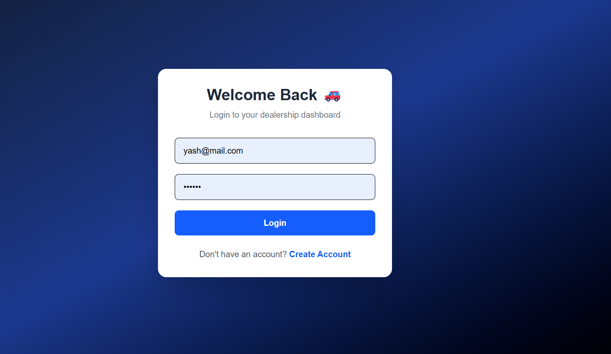
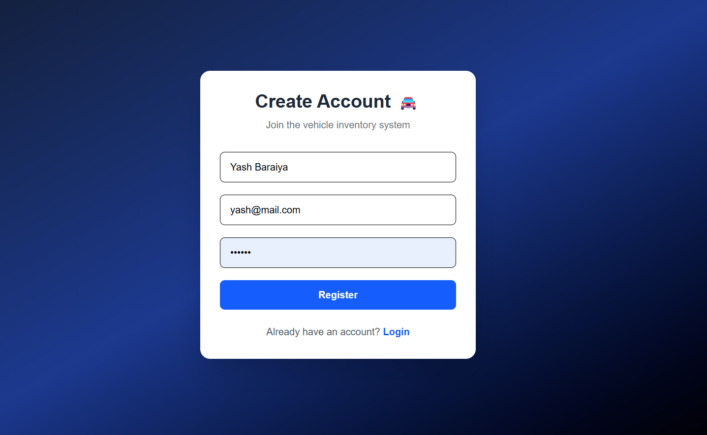
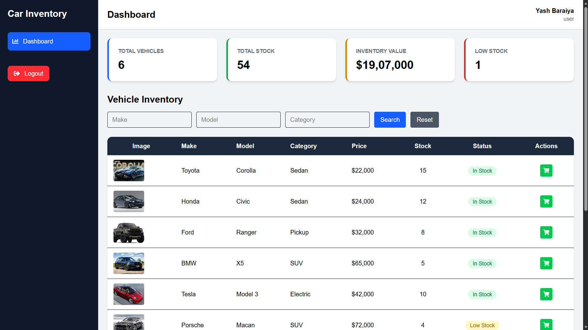
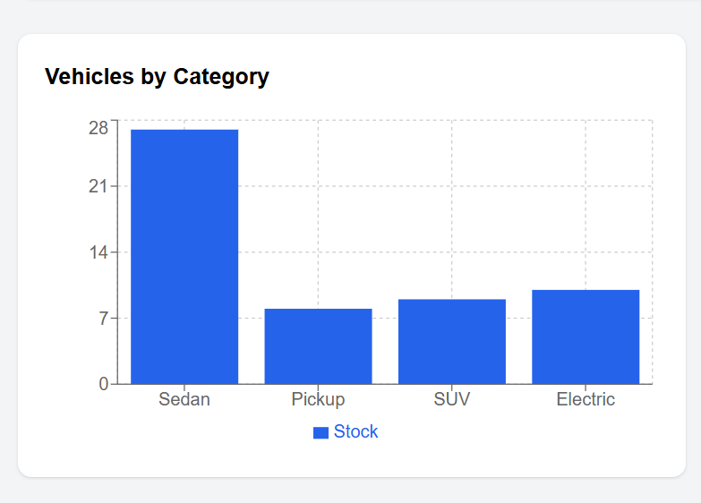
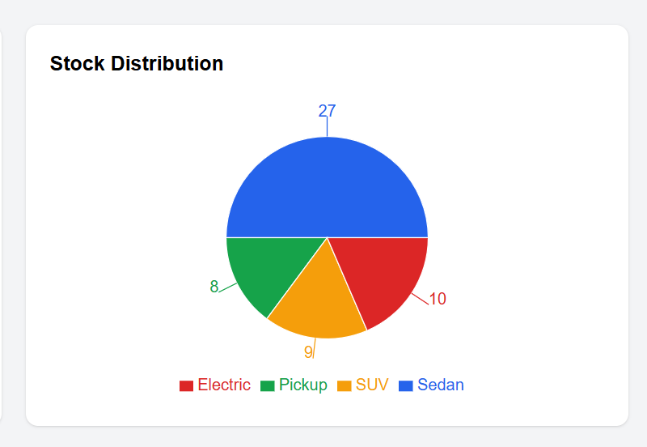
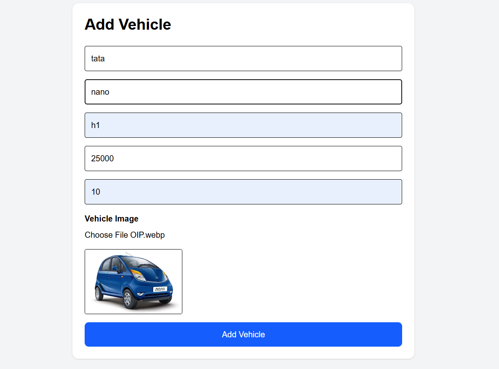
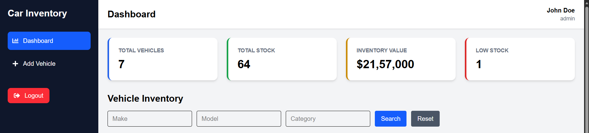
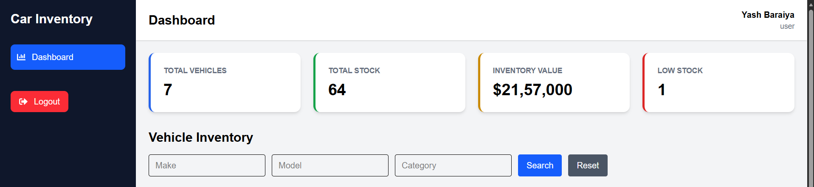

# 🚗 Car Dealership Inventory Management System

<p align="center">
A full-stack MERN application for managing dealership vehicles, inventory, users, and analytics.
</p>

---

# 📌 Overview

Car Dealership Inventory Management System is a modern web application designed to help automobile dealerships manage their vehicle inventory efficiently.

The system provides:

- Secure authentication
- Role-based access control
- Vehicle inventory management
- Dashboard analytics
- Stock visualization
- Responsive user interface

---

# 🎯 Project Goals

- Replace manual inventory management
- Track available vehicle stock
- Provide real-time inventory insights
- Build scalable MERN architecture
- Implement secure user access

---

# ✨ Features

## 🔐 Authentication

- User Registration
- User Login
- JWT Authentication
- Protected Routes
- Password Encryption
- Role-Based Authorization


---

# 👥 User Roles

## 👨‍💼 Admin

Admin can:

- Access dashboard
- Add vehicles
- Manage inventory
- View analytics
- Access admin-only pages


## 👤 User / Staff

User can:

- Login
- View dashboard
- Access allowed features

Admin features are hidden from normal users.

---

# 🚘 Vehicle Management

Vehicle information:

| Field | Description |
|---|---|
| Make | Vehicle Brand |
| Model | Vehicle Model |
| Category | SUV, Sedan, Hatchback |
| Price | Vehicle Price |
| Quantity | Available Stock |
| Created Date | Added Date |


Features:

- Add vehicles
- Update vehicles
- Delete vehicles
- Track inventory quantity

---

# 📊 Dashboard Analytics

Dashboard includes:

- Total vehicle count
- Inventory statistics
- Category based stock chart
- Stock distribution chart


Charts are built using:

- Recharts


---

# 📸 Screenshots


## 🔐 Login Page




## 📝 Register Page




## 📊 Dashboard




## 📈 Vehicle Category Chart




## 📦 Stock Distribution




## ➕ Add Vehicle




## 👨‍💼 Admin Sidebar




## 👤 User Sidebar




---

# 🏗️ Application Architecture

          Client Browser

                |
                |

          React Frontend

                |
                |

           Axios API

                |
                |

         Express Backend

                |
                |

          MongoDB Database


---

# 🛠️ Tech Stack


## Frontend

- React.js
- Vite
- Tailwind CSS
- React Router DOM
- Axios
- React Icons
- Recharts


## Backend

- Node.js
- Express.js
- MongoDB
- Mongoose
- JWT
- bcrypt


## Development Tools

- VS Code
- Git
- GitHub
- Postman

---
# Project Structure
```text
car-dealership-inventory/
├── frontend/
│   ├── src/
│   │   ├── assets/       # Static assets & images
│   │   ├── components/   # Shared UI components (Navbar, Sidebar, Charts)
│   │   ├── context/      # Auth & Global state providers
│   │   ├── layouts/      # Dashboard & Auth layouts
│   │   ├── pages/        # Route views (Login, Dashboard, Vehicles)
│   │   └── services/     # Axios API client setup
│   └── package.json
│
├── backend/
│   ├── src/
│   │   ├── config/       # Database configuration (db.js)
│   │   ├── controllers/  # Route logic for auth & vehicles
│   │   ├── middleware/   # JWT verify & RBAC middleware
│   │   ├── models/       # Mongoose schemas (User, Vehicle)
│   │   ├── routes/       # API route endpoints
│   │   └── services/     # Business logic handlers
│   └── package.json
│
├── screenshots/          # Application previews
└── README.md
```

---


## Clone Repository

```bash
git clone <repository-url>

cd car-dealership-inventory
